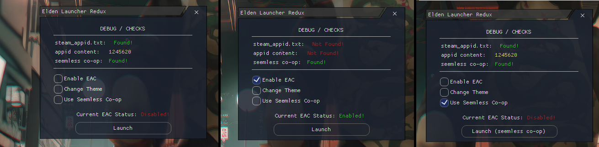

# Elden-Ring-C-EAC-Swapper (still working after Colosseum update)
a simple UI to swap EAC on and off for Elden Ring.. written in c#

> - has worked since release, just drop in the game directory and create a shortcut, i cleaned up the final exe

# To Use:
Place the .rar contents in the Elden Ring Base Folder, launch using the EldenRingLauncher2.exe to pull up the menu

this will allow you to: 1) launch the game normally    2) launch with EAC disabled or enabled   3) launch with seam-less co-op

