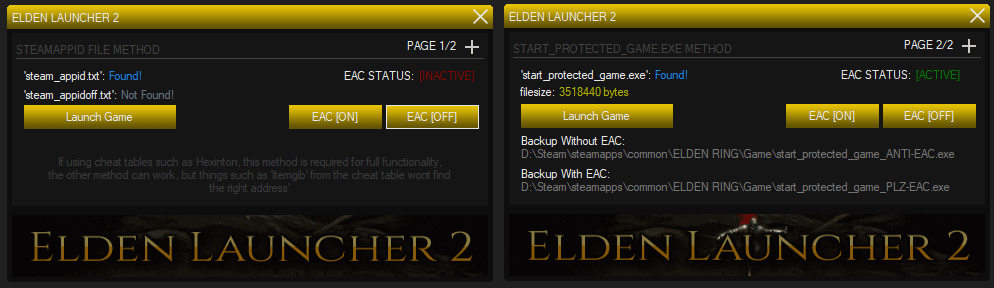

# Elden-Ring-C-EAC-Swapper
a simple UI to swap EAC on and off for Elden Ring.. written in c#

# To Use, Place the .EXE in a FRESH/VERIFIED Elden Ring Base Folder

> - I have updated from the old version to just use the steam_appid.txt bypass. also added a check to find and start with seemless co-op
> - the source will not be provided til i add a couple features, DOWNLOAD IT FROM THE RELEASE SECTION ->

> - unless there is an actual problem with the program i will no longer be adding fixes, or features (most likely), if the source becomes available you can add your own changes/features

