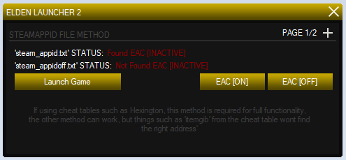
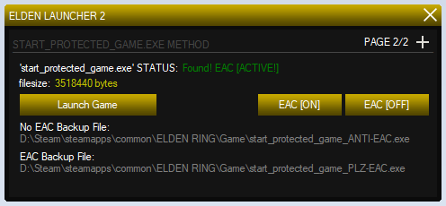

# Elden-Ring-C-EAC-Swapper
a simple UI to swap EAC on and off for Elden Ring.. written in c#

# To Use, Place the .EXE in a FRESH/VERIFIED Elden Ring Base Folder

> - Updated!, added the 2nd method which uses steam_appid.txt file, to disable EAC
> - it would be wise to delete the backups of the EXE's every update since they will be wrong version- i wont be adding autoupdate
you could also use the new method which doesnt swap any files, just uses a new text file and changes it according to what you want EAC to be
> - you can download the source so do whatever you want with it, (sorry for poor code, i am a noob)

The launch button on the program, will launch it from the exe used in the method for that page

